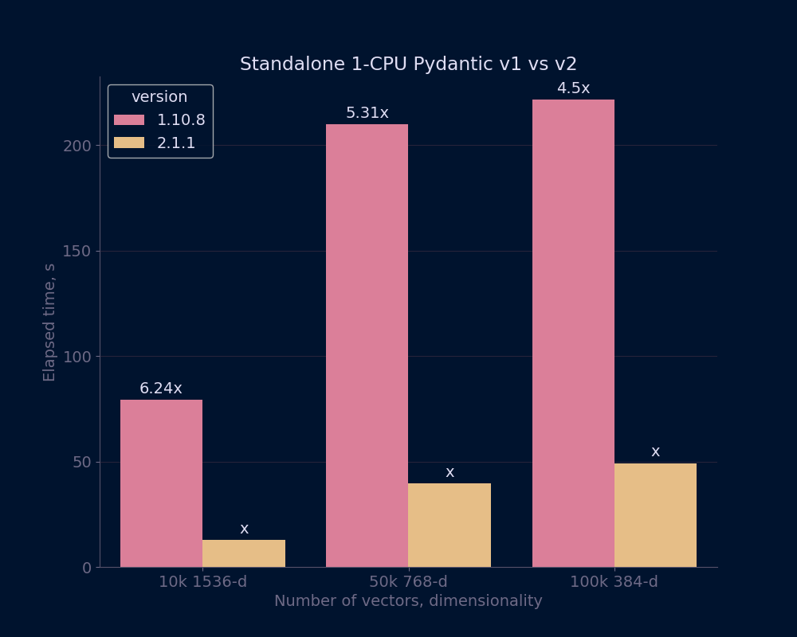

## Qdrant-client Pydantic v1 vs v2 comparison

Qdrant-client has recently introduced support for Pydantic v2.

This repo contains code for performance comparison between `qdrant-client` with `Pydantic v1 (1.10.8)` and `Pydantic v2 (2.1.1)`.

### How to run
```bash
chmod +x install.sh
chmod +x run.sh
./install.sh # install dependencies, prepare environment for benchmarking
./run.sh # run benchmarking, build plots
```


### Results
Result of benchmarking is presented in `results` folder.

It contains raw results file `bench.jsonl` and corresponding plot in `bench.png`

### Example

Benchmark was run on a single node Qdrant instance with the client limited to use 1 CPU.

```JSON
{"dim": 1536, "vector_num": 10000, "display_name": "10k 1536-d"},
{"dim": 768, "vector_num": 50000, "display_name": "50k 768-d"},
{"dim": 384, "vector_num": 100000, "display_name": "100k 384-d"},
```

The following results were obtained:
